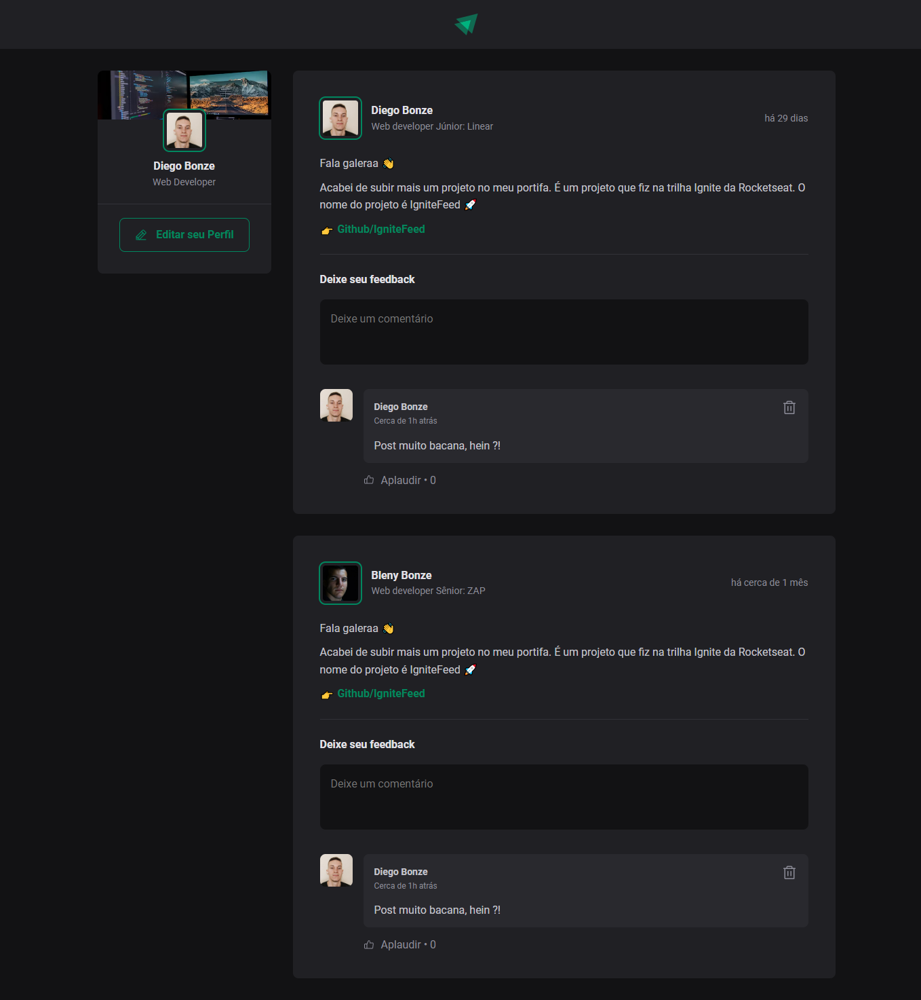

<h1 align="center"> Ignite Feed </h1>

Projeto exclusivo, feito atravez da Rocketseat para ensino de tecnologias WEB.

  <a href="#-tecnologias">Tecnologias</a>&nbsp;&nbsp;&nbsp;|&nbsp;&nbsp;&nbsp;
  <a href="#-projeto">Projeto</a>&nbsp;&nbsp;&nbsp;|&nbsp;&nbsp;&nbsp;
  <a href="#-layout">Layout</a>&nbsp;&nbsp;&nbsp;|&nbsp;&nbsp;&nbsp;

 

  

Projeto desenvolvido pela Rocketseat

[🔗 Clique aqui para acessar](https://ignite-feed-rosy.vercel.app/)

## 🚀 Tecnologias

Esse projeto foi desenvolvido com as seguintes tecnologias:

- HTML e CSS
- [React](https://reactjs.org/)
- [TypeScript](https://www.typescriptlang.org/)
- [Vite](https://vitejs.dev/)

## 💻 Projeto

- React com Typescript
- Criação do HTML e CSS
- Separação dos Componentes
- Iterações/Laço de repetição { .map }
- Comunicação entre componentes através de Propriedades.
- uso de Estado ( useState )
- Layout responsivo

## 🔖 Layout

Você pode visualizar o layout do projeto através [DESSE LINK](https://www.figma.com/file/3DqhMt8PETGFMfNVzEt1lJ/Ignite-Feed-(Community)?node-id=0-1&t=OIMJRqBuOl8nH87E-0). É necessário ter conta no [Figma](https://figma.com) para acessá-lo.

## 💜 Contatos

[LinkedIn](https://www.linkedin.com/in/diego-bonze-518225208/)

diegobonze1@gmail.com
